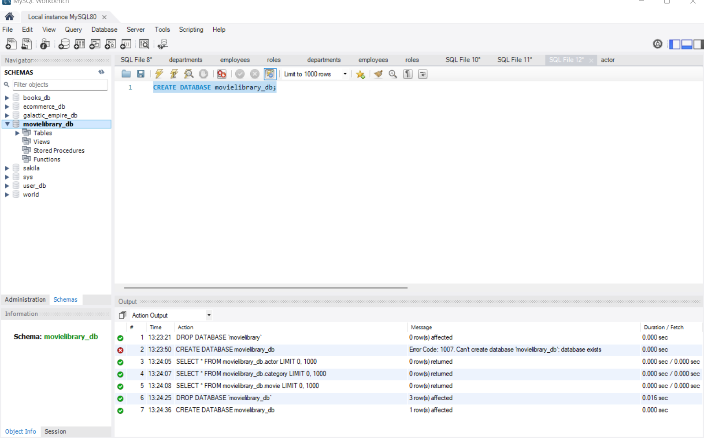
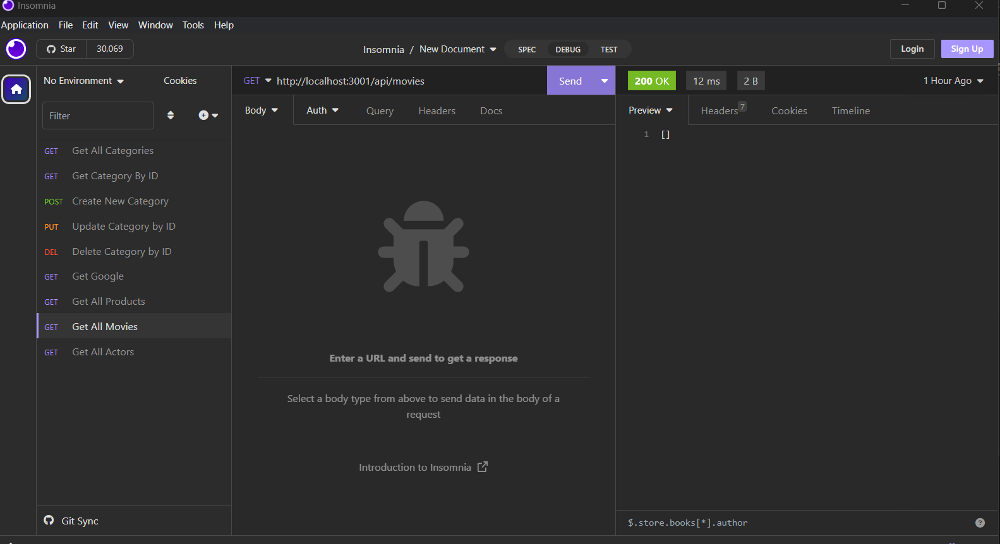
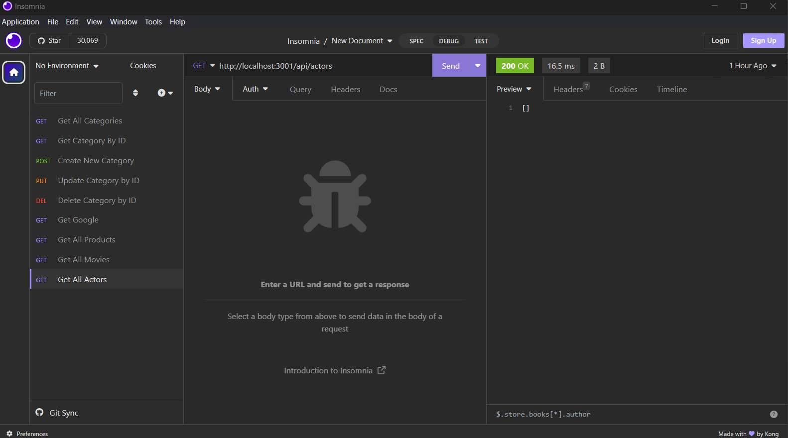
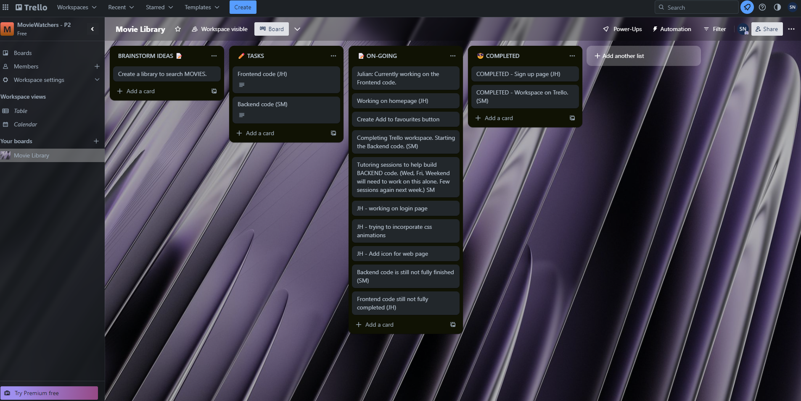

# P2 Movie-Library
# Main Task: Interactive Full-Stack Application

To create a real-world full-stack application that you’ll be able to showcase to potential employers.

* Use Node.js and Express.js to create a RESTful API.

* Use Handlebars.js as the template engine.

* Use MySQL and the Sequelize ORM for the database.

* Have both GET and POST routes for retrieving and adding new data.

* Use at least one new library, package, or technology that we haven’t discussed.

* Have a folder structure that meets the MVC paradigm.

* Include authentication (express-session and cookies).

* Protect API keys and sensitive information with environment variables.

* Be deployed using Heroku (with data).

* Have a polished UI.

* Be responsive.

* Be interactive (i.e., accept and respond to user input).

* Meet good-quality coding standards (file structure, naming conventions, follows best practices for class/id naming conventions, indentation, quality comments, etc.).

* Have a professional README (with unique name, description, technologies used, screenshot, and link to deployed application).

Many contributions between group members.

## Final Work Review

**"Always leave the code a little cleaner than when you found it."**  This action was applied to HTML, CSS and JAVASCRIPT. To create a real-world application from scratch, we have used Lawrence Wilson's Audiobook, Cathy Tanimura's book on SQL., references for our style.css on Google, W3Schools, CSSPortal, Snyk and all ZOOM recordings (of previous classes). Looks much cleaner, organised and easier to find what you are looking for. Comments were added in JAVASCRIPT to show what was done and for what purpose. Trello and Slack throughout our project has helped us deligate tasks and see what is still on-going. 
To work on the backend code, our group received the help of my tutor, Erik Hoversten. He helped cleaned up the code and fix multiple errors I have encountered while building this database. 

> **(CARL-VIRT-FSF-PT-04-2023, Project 2 / README.md 2023)**

> **(JavaScript Full Stack Developers, Lawrence Wilson; Audiobook (2023) 6hrs and 29mins. )**

> **(SQL for Data Analysis: Advanced Techniques for Transforming Data into Insights, Cathy Tanimura; 1st edition (Oct. 19th 2021) 357 pages.)** 

## What We Learned:

Our group took initiative and challenged ourselves by seperating tasks between us. Julian took the initiative to concentrate fully on the frontend code and I, Sophie, took control of the backend code. For us, this task was extremely difficult but also rewarding eventhough our application is not fully functional. We both learned how important collaboration is during a project. Better communication between team members, increased productivity and improved morale. When team members are working towards a common goal, it can build on each other's ideas, strenghts and weaknesses while feeling like a successful team. This experience will definetely help us in the future.

## Future Development of Application: 

As of today, our application definitely needs MAJOR improvements especially with the backend and frontend code. Not only were we missing one group member but we are still learning how to properly connect frontend code with backend code. As the backend developer for this project, I, Sophie, need to work on making sure our database code is done correctly but also need to work on implementing the backend code with frontend code with RESTful API communication through an integration layer exposing the existing system. This connection between frontend and backend code would also make it possible to deploy to Heroku, which at this moment we are unable to achieve. Once these implementations are completed, the frontend code could be updated and help with the design aspects of our project. The connection to Insomnia is being made, which is great but we need to finish debugging the backend code which could take another week.(Please refer to screenshots below.)

## Screenshots: 

## Trello:

## Heroku Link:

Not able to make a Heroku connection due to the fact that our backend code and frontend code is not completed.

## Github Repository Link:

[GIT REPOSITORY](https://github.com/JulianTymeczko/Movie-Library)